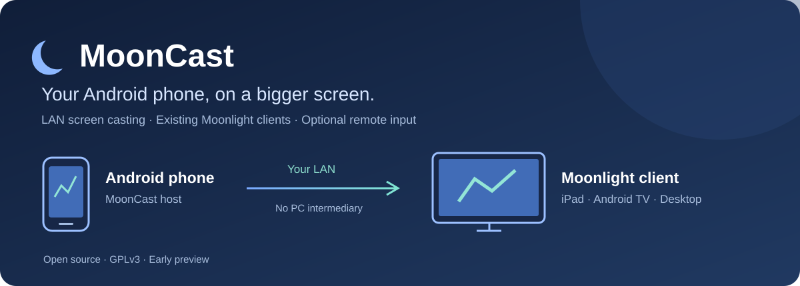

<p align="center"></p>
<p align="center"><a href="README.md">English</a> · <b>简体中文</b></p>

# MoonCast

**让安卓手机成为 Moonlight 的发射端。** 在局域网内将手机画面投到 iPad、Android TV 或其他 Moonlight 客户端，无需电脑中转。

专注手机投屏：保留完整画面、内置视频区域裁切、同步播放声音，可选关闭手机本地声音，以及默认关闭的 Root／非 Root 反控。普通录屏无需 Root 或 ADB。

当前为 **0.2.2 预览版**，APK 使用本地 debug 密钥签名。安卓 → iPad 基础投屏已有一次真机使用记录；用户试用 0.2.0 后反馈「貌似没啥问题」，但这不等于裁切、静音、反控已逐项验证。0.2.2 主要界面跟随系统语言，英文默认、中文系统显示中文；提供中英文文档，底层诊断尚未完全翻译。

## 下载与开始

1. 在 Android 8.0+ 手机安装 [0.2.2 Preview APK](https://github.com/meta-tabchen/MoonCast/releases/tag/v0.2.2)。
2. 接收端安装 [官方 Moonlight](https://moonlight-stream.org/)，两端连接同一可信局域网。
3. 手机点击「启动投屏」，授权共享**整个屏幕**。
4. Moonlight 添加手机 IP，将接收端显示的四位 PIN 输入手机配对框。
5. Moonlight 打开 `Desktop`，手机切换到要播放的视频或应用。

建议先使用 1080p60、H.264/HEVC、30–50 Mbps 验证，设备编码器、解码器和网络决定上限。这不是性能承诺。

[详细中文使用说明](docs/usage.zh-CN.md) · [英文快速入门](docs/getting-started.md) · [Release 下载](https://github.com/meta-tabchen/MoonCast/releases/tag/v0.2.2)

## 有什么特点？

- 接收端直接使用 Moonlight，复用其配对、硬件解码和客户端生态。
- 保留整屏、自动去黑边、视频铺满、固定中央 16:9 四种模式；固定区域无需手动框选。
- Android 10+ 可同步允许被捕获的播放声音，可选仅投音频时静音手机并在结束后恢复。
- 非 Root 反控使用无障碍点击与单指滑动；Root 可尝试持续触摸和基础键盘。两者均需明确授权。
- 运行时无需 MoonCast 账号、广告或云端服务。

## 与其他方案比较

| 方案 | 主要用途 | MoonCast 的定位 |
| --- | --- | --- |
| [Mirror](https://github.com/jqssun/android-display-mirror) | 安卓多协议显示分享，支持 Moonlight/AirPlay/DisplayLink，可选 Shizuku 反控 | 本项目复用其原生核心，应用层专注视频比例、手机声音和两种反控后端 |
| [scrcpy](https://github.com/Genymobile/scrcpy) | 安卓 → 电脑的成熟镜像、录制和控制，普通镜像通过 ADB | MoonCast 直接连接现有 Moonlight 接收端，无需电脑中转 |
| [Sunshine](https://docs.lizardbyte.dev/projects/sunshine/latest/md_docs_2getting__started.html) | 桌面作为 Moonlight 发射端 | MoonCast 面向安卓手机，兼容相同客户端生态 |

这是使用方式的对比，没有进行延迟或画质性能排名。[详细对比与来源](docs/comparison.md)。

## 需要了解的限制

目前只支持一个活跃接收端。H.264/HEVC SDR 仍是有损编码，没有实现数学无损、原文件播放、HDR、AV1 或 DRM 捕获。固定 16:9 假定横屏视频居中；自动去黑边属于启发式，需要更多真实播放器验证。较方的 iPad 要保留完整 16:9 视频时，必要的上下黑边仍会存在。

Root 屏幕捕获及 Root 反控为实验功能；非 Root 滑动在抬手后执行，不支持任意文字键盘、多指和持续按住。Root 捕获目前仅视频。新版静音的实际扬声器／捕获行为仍需 ROM 实测。

[兼容性范围](docs/compatibility.md) · [英文验证记录](docs/validation.md) · [详细历史验证](VALIDATION.md)

## 构建

需要 JDK 17、Android SDK 35、Build Tools 35.0.0。

```sh
./gradlew :app:assembleDebug :app:lintDebug
python scripts/run_unit_tests.py
python scripts/verify_apk.py app/build/outputs/apk/debug/app-debug.apk
```

Windows 使用 `gradlew.bat`。默认构建使用已固定、已校验的原生库，仓库保留完整对应源码及依赖许可证。从源码重编译原生核心需要额外 NDK/CMake 工具链，本预览版尚未验证该路径。[完整构建说明](docs/building.md)。

## 参与

欢迎提交设备兼容性报告、修复、翻译和真实测试结果。请附手机型号／系统、Moonlight 版本、码率／帧率／分辨率和复现步骤，删除日志中的私密信息。[贡献指南](CONTRIBUTING.md) · [路线图](docs/roadmap.md) · [问题反馈](https://github.com/meta-tabchen/MoonCast/issues)。如果有用，欢迎 Star 帮更多 Moonlight 用户找到它。

## 许可证与致谢

[GPLv3](LICENSE)。原生核心复用 [Mirror](https://github.com/jqssun/android-display-mirror) 对 [Sunshine](https://github.com/LizardByte/Sunshine) 的安卓移植，并非本项目从零实现。感谢 Mirror、Sunshine、Moonlight 和依赖维护者。[完整署名](THIRD_PARTY_NOTICES.md) · [固定源码版本](native/SOURCE_LOCK.json)。本项目独立维护，不代表上游官方。
