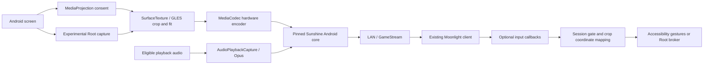

# Architecture

## Ownership

- `MainActivity` owns settings and communicates with the independent `:host` service process.
- `HostService` owns capture permission, audio, discovery, native session resources, and shutdown. Pairing identities remain in private phone app storage.
- `VideoPipeline` samples the screen texture and applies `CropGeometry` / `AutoCropTracker` mapping before writing to the encoder Surface. Fixed-center cropping is a preset, not player introspection.
- The native core handles GameStream server APIs, PIN/certificate pairing, RTSP, video RTP/FEC, audio transport, and control protocol callbacks.
- `InputBridge` forwards optional callbacks to `RemoteInputController`. Rendering and input share the same geometric mapping; clicks in output letterboxing are rejected.
- Root injection uses a separate UID-0 broker and a random local socket with peer UID checks. Capture and input Root options are distinct. Owner disconnect/stop attempts to release held keys/pointers.

## Cleanup and privacy

Stop releases capture/display/audio/discovery/wake lock resources and ends the native host process. Media volume uses an atomic recovery journal. Accessibility requests gesture capability without window-text retrieval. Runtime has no MoonCast account or cloud dependency; local-network protocol traffic and pairing data still exist. Diagnostic output can reveal network and screen details, so redact reports.

This explains intended behavior, not a completed security audit or exhaustive runtime validation. Native upstream code is retained as a pinned snapshot; future changes should preserve provenance and JNI compatibility.
