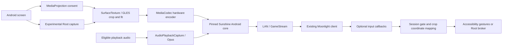

# Architecture

## Ownership

- `MainActivity` owns settings and communicates with the independent `:host` service process.
- `HostService` owns capture permission, audio, discovery, native session resources, and shutdown. Pairing identities remain in private phone app storage.
- `VideoPipeline` samples the screen texture and applies `CropGeometry` / `AutoCropTracker` mapping before writing to the encoder Surface. Fixed-center cropping is a preset, not player introspection.
- The native core handles GameStream server APIs, PIN/certificate pairing, RTSP, video RTP/FEC, audio transport, and control protocol callbacks.
- `InputBridge` forwards optional callbacks to `RemoteInputController`. Rendering and input share the same geometric mapping; clicks in output letterboxing are rejected.
- Root injection uses a separate UID-0 broker and a random local socket with peer UID checks. Capture and input Root options are distinct. Owner disconnect/stop attempts to release held keys/pointers.

## Cleanup and privacy

Stop releases capture/display/audio/discovery/wake lock resources and ends the native host process. Media volume uses an atomic recovery journal. Accessibility requests gesture capability without window-text retrieval. Runtime has no MoonCast account or cloud dependency; local-network protocol traffic and pairing data still exist. Diagnostic output can reveal network and screen details, so redact reports.

This explains intended behavior, not a completed security audit or exhaustive runtime validation. Native upstream code is retained as a pinned snapshot; future changes should preserve provenance and JNI compatibility.

## 0.3 additions

One input SurfaceTexture/capture feeds EGL outputs keyed by native session, each with its
negotiated dimensions. Native callbacks register/unregister handles under the session
registry lock; individual stop uses a separately pinned JNI shim to an existing native
export. Encoder shutdown detaches that output before releasing its Surface. Watch party
caps at three and disables session-ambiguous input; framing and audio packet duration are
shared. GPU fan-out alone is not multi-encoder interoperability evidence.

Shizuku uses a private owner-binder-gated user service, with Root/shell UID verification,
owner-death input/display cleanup and correct provider/non-provider binder handoff.
It can create/launch on an independent app display and optionally route input there.
Android 14 app picker capture has no reliable physical-window coordinate mapping, so
input is disabled for that source. Independent display currently sends video only.

The separate `:files` foreground service owns one SAF-selected document and a tokenized
bounded LAN HTTP server. Original bytes/ranges, browser UI and stop/replacement revocation
are independent of the screen mirror and Moonlight sessions.

Local panel power is an explicit per-session privileged option, enabled after submitted
frames. A pure-Java lease owns off/restore/pending state; shell/root helpers call physical
power APIs without locking Android. Leases and host heartbeat expire in 30 seconds;
manual restore/stop/error/owner loss attempt restoration before helper teardown. Failed
restore remains pending for retries. A privileged helper forcibly killed before restoration
or driver failure can defeat this; recovery guarantees are deliberately bounded.

## Reconnect and shutdown

The foreground `:host` process owns MediaProjection and the one capture input. The
pinned native runtime runs in a private bound `:stream` service. Encoder Surfaces cross
Binder; encoder departure synchronously detaches EGL before its IPC Surface is released.
Playback PCM and optional input callbacks cross the same private binding. Owner death
terminates the stream process.

When the last receiver leaves, capture remains alive; audio/mute/panel ownership is
released and only the stream process restarts. This avoids reusing stopped native network
threads while keeping the Android 14+ consumed capture grant in its original owner.
The UI shows preparing-reconnection until the replacement HTTP listener answers. A new
session in ordinary single-receiver mode replaces an old session that has not completed
its ENet disconnect timeout. Watch party keeps its receiver cap and common audio packet
requirement; Root capture still uses its separate daemon.

Stop messages use a separate command looper. A four-second process-exit deadline is armed
before cleanup, independently of the main/render loopers. Normal cleanup still releases
resources first. Native session membership reads do not wait for the lifetime lock held
by a disconnect. UI bindings handle null/dead bindings and expire unanswered pending binds,
so a disappeared service cannot leave the Start button permanently hidden.
